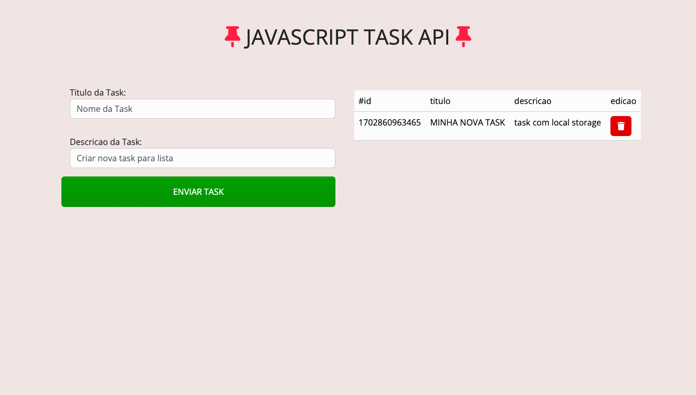

# JAVASCRIPT-TASK-API
## DEPLOY : 

## OVERVIEW
Criacao de API com vainilla javascript para manejo de tarefas usando conceitos como:
- Manipulacao do DOM
- Manipulacao de Eventos
- Criacao de Classes e Meetodos usando Programacao Orientada a Objetos em JS
- Manipulacao de Dom e Poo para edicao de Valores 
- Uso de localStorage para guardar dados de forma local em navegador do cliente
- Estilizacao basica usando bootstrap com tema especial proveniente de site BOOTSWATCH

## building process
- codigo versionado e segmentado em branchs segundo funcionalidades agregadas em cada momento com commits e descricoes detalhadas do que foi feito em cada momento
- merge realizado ao final de cada branch para atualizacao de main

## TECNOLOGIAS E FRAMEWORKS USADOS
- JAVASCRIPT VAINILLA
- HTML para estruturacao semantica da pagina
- NORMALIZE: para padronizacao de estilos em broswser
- CSS para algumas personalizacoes de estilos
- BOOTSTRAP com tema proveniente de BOOTSWATCH

## Resultados : 

